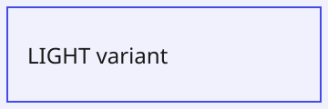

= Theme-Adaptive Images Test
:description: Test page for role=theme-adaptive light/dark image variants.

This page exercises the `role=theme-adaptive` convention: an image with that role swaps to a `-dark` suffixed sibling file when the site theme is dark. Toggle the theme switch in the header to verify each case.

== Block image with role=theme-adaptive

Should show the LIGHT variant in light mode and the DARK variant in dark mode.

== Inline image with role=theme-adaptive

Inline form, same swap behavior: 

== Missing dark variant (fallback)

This image is tagged theme-adaptive but has no `-dark` sibling. It must fall back to the light variant in dark mode instead of rendering a broken image.

== Control image (no role)

This image has no role and must never swap.

== Lightbox

Click the block image at the top while in dark mode, then toggle the theme with the lightbox open: the enlarged copy must swap along with the inline copy.
